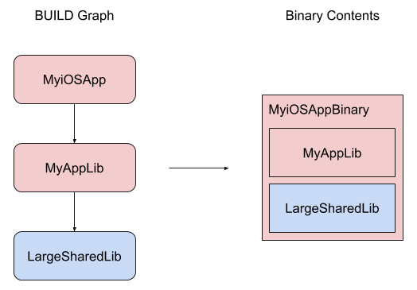
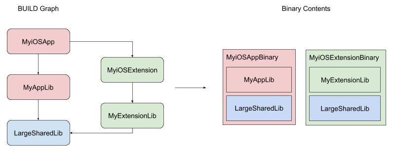
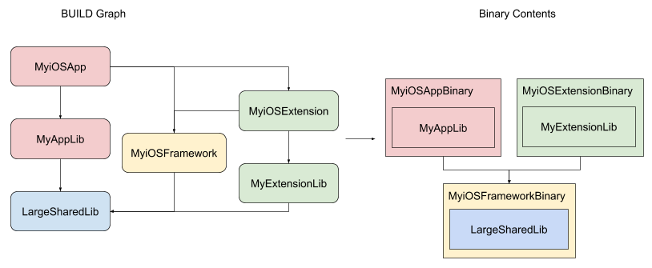
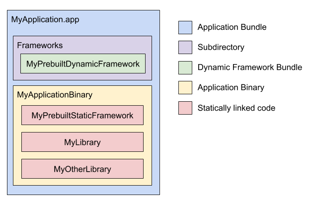

# Apple Rules - Frameworks

## Background

This document describes the usages of framework rules and how to integrate them
into application rules. In this document a framework will be defined as an Apple
bundle with a `.framework` extension, used to share code either as a
distributable SDK or between applications and extensions within an application
bundle.

There are two types of framework bundles, and the difference lies in how the
underlying binary will be linked into the final application binary, and
how/where the resources will be packaged inside the application bundle:

*   Dynamic Frameworks: These frameworks contain fully linked dylib binaries.
    Application/Extension/Framework binaries link dynamically against the dylib
    and will expect it to be present at runtime at a specific location
    determined by the `-rpath` linker flag. Dynamic frameworks are packaged into
    application bundles under the Frameworks directory, preserving the
    `.framework` bundle structure, which may include resources.
*   Static Frameworks: These frameworks contain unlinked object archive
    binaries. Application/Extension/Framework binaries link the archive
    statically, meaning that the code objects will be embedded in the linked
    binary. Static frameworks are not packaged into the application bundle.
    However, any resources that the static framework bundle might contain should
    be copied into the root of the linked application binary's bundle.

The Apple rules supports two mechanisms to use framework bundles:

*   Framework bundles imported from the workspace.
*   Framework bundles created dynamically during the build.

Frameworks imported from the workspace are useful when integrating 3rd party
dependencies that are distributed in precompiled Dynamic or Static frameworks.
For imported bundles there are two available rules:

*   `apple_dynamic_framework_import` for Dynamic Frameworks.
*   `apple_static_framework_import` for Static Frameworks.

Frameworks created dynamically during the build is the recommended approach for
1st party dependencies. For framework bundles created dynamically during the
build, there are two available approaches:

*   `ios_framework/tvos_framework` for Dynamic Frameworks: This rule is
    optimized for sharing binary code between application and extension binaries
    in iOS/tvOS applications. It was __not__ designed to build a distributable
    Dynamic Framework.
*   `ios_static_framework` for Static Frameworks: This rule is optimized for
    distributing precompiled code to be integrated into other build systems. It
    was not designed for building iOS applications during a bazel build.

NOTE: macOS and watchOS frameworks are not yet supported.

## Described Use Cases

### `ios_framework`

A simple `ios_application` target might look like this:

```build
ios_application(
  name = "MyiOSApp",
  deps = [":MyAppLib"],
)

objc_library(
  name = "MyAppLib",
  srcs = [...],
  deps = [":LargeSharedLib"],
)

objc_library(
  name = "LargeSharedLib",
  srcs = [...],
)
```



If an `ios_extension` is added to the `BUILD` graph, it would instead look like
this:

```build
ios_application(
  name = "MyiOSApp",
  deps = [":MyAppLib"],
)

ios_extension(
  name = "MyiOSExtension",
  deps = [":MyExtensionLib"],
)

objc_library(
  name = "MyAppLib",
  srcs = [...],
  deps = [":LargeSharedLib"],
)

objc_library(
  name = "MyExtensionLib",
  srcs = [...],
  deps = [":LargeSharedLib"],
)

objc_library(
  name = "LargeSharedLib",
  srcs = [...],
)
```



With this setup, both the application and extension binaries have statically
linked the shared library into their binaries, increasing the size of the binary
contents of the application bundle. In order to reduce this size, an
`ios_framework` target could be introduced to extract the shared library from
the application and extension binaries:

```build
ios_application(
  name = "MyiOSApp",
  frameworks = [":MyiOSFramework"],
  deps = [":MyAppLib"],
)

ios_extension(
  name = "MyiOSExtension",
  frameworks = [":MyiOSFramework"],
  deps = [":MyExtensionLib"],
)

ios_framework(
  name = "MyiOSFramework",
  deps = [":LargeSharedLib"],
)

objc_library(
  name = "MyAppLib",
  srcs = [...],
  deps = [":LargeSharedLib"],
)

objc_library(
  name = "MyExtensionLib",
  srcs = [...],
  deps = [":LargeSharedLib"],
)

objc_library(
  name = "LargeSharedLib",
  srcs = [...],
)
```



Keep in mind that by introducing the `ios_framework` target, the original
dependency graph has not been modified. Therefore `ios_framework` can be thought
of as a tool to manage how code is packaged inside the different binaries
present within an iOS application bundle.

### `apple_dynamic_framework_import` and `apple_static_framework_import`

In order to depend on an imported pre-built static or dynamic framework, you'll
need to wrap the files using either the `apple_dynamic_framework_import` or
`apple_static_framework_import` rule:

```build
apple_static_framework_import(
  name = "MyPrebuiltStaticFramework",
  framework_imports = glob(["MyPrebuiltStaticFramework.framework/**"]),
)

apple_dynamic_framework_import(
  name = "MyPrebuiltDynamicFramework",
  framework_imports = glob(["MyPrebuiltDynamicFramework.framework/**"]),
)
```

To compile and link against these targets, they need to be added into the deps
attribute of a library target:

```build
objc_library(
  name = "MyLibrary",
  srcs = [...],
  deps = [":MyPrebuiltStaticFramework"],
)

objc_library(
  name = "MyOtherLibrary",
  srcs = [...],
  deps = [":MyPrebuiltDynamicFramework"],
)

apple_static_framework_import(
  name = "MyPrebuiltStaticFramework",
  framework_imports = glob(["MyPrebuiltStaticFramework.framework/**"]),
)

apple_dynamic_framework_import(
  name = "MyPrebuiltDynamicFramework",
  framework_imports = glob(["MyPrebuiltDynamicFramework.framework/**"]),
)
```

`apple_static_framework_import` targets are linked statically along with any
library target that references them. `apple_dynamic_framework_import` targets on
the other hand, are propagated downstream to the top-level bundling rule, and
the imported files will be packaged inside the Frameworks directory of the
bundle. This way, imported Dynamic Frameworks can be used at runtime by the
application:

```build
ios_application(
  name = "MyApplication",
  deps = [
    ":MyLibrary",
    ":MyOtherLibrary",
  ],
)

objc_library(
  name = "MyLibrary",
  srcs = [...],
  deps = [":MyPrebuiltStaticFramework"],
)

objc_library(
  name = "MyOtherLibrary",
  srcs = [...],
  deps = [":MyPrebuiltDynamicFramework"],
)

apple_static_framework_import(
  name = "MyPrebuiltStaticFramework",
  framework_imports = glob(["MyPrebuiltStaticFramework.framework/**"]),
)

apple_dynamic_framework_import(
  name = "MyPrebuiltDynamicFramework",
  framework_imports = glob(["MyPrebuiltDynamicFramework.framework/**"]),
)
```



## Migration

`apple_dynamic_framework_import` and `apple_static_framework_import` are
Starlark replacement rules for the native `objc_framework` rule, which is
deprecated and slated to be removed in Q1-19. The following is an example of how
migration will happen for `objc_framework` targets for Dynamic Frameworks:

```build
objc_framework(
  name = "MyPrebuiltDynamicFramework",
  framework_imports = glob(["MyPrebuiltDynamicFramework.framework/**"]),
  is_dynamic = 1,
  sdk_dylibs = [...],
  sdk_frameworks = [...],
  weak_sdk_frameworks = [...],
)

apple_dynamic_framework_import(
  name = "MyPrebuildDynamicFramework",
  framework_imports = glob(["MyPrebuiltDynamicFramework.framework/**"]),
)
```

Notice that the `sdk_frameworks`, `weak_sdk_frameworks` and `sdk_dylibs` were
removed. This is because Dynamic Frameworks are already linked, and this
information should already be encoded in the binary. If your build starts
failing after this change, it means that the import was masking another library
that required an extra SDK framework/dylib. That library should be fixed
instead.

For Static Frameworks, migration would look like this:

```build
objc_framework(
  name = "MyPrebuiltStaticFramework",
  framework_imports = glob(["MyPrebuiltStaticFramework.framework/**"]),
  sdk_dylibs = [...],
  sdk_frameworks = [...]
  weak_sdk_frameworks = [...],
)

apple_static_framework_import(
  name = "MyPrebuildStaticFramework",
  framework_imports = glob(["MyPrebuiltStaticFramework.framework/**"]),
  sdk_dylibs = [...],
  sdk_frameworks = [...]
  weak_sdk_frameworks = [...],
)
```
